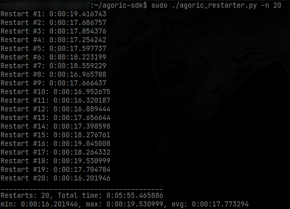

# Agoric restarter

A script for performing restarts of the `ag-chain-cosmos service` (Agoric node).



## **How it works**

Finds the service logs when the service was started and when the first block was received from the chain. Calculates the difference between them and displays.

## Prerequisites

- python >= 3.6
- Agoric node with systemd service ([How to install Agoric validator node](https://github.com/Agoric/agoric-sdk/wiki/Validator-Guide))

## Usage

The number of restarts can be specified using the `n` parameter, by default, it is 1.

```bash
wget https://raw.githubusercontent.com/erc30/agoric-restarter/main/agoric_restarter.py
chmod +x agoric_restarter.py
sudo ./agoric_restarter.py -n 3
```

